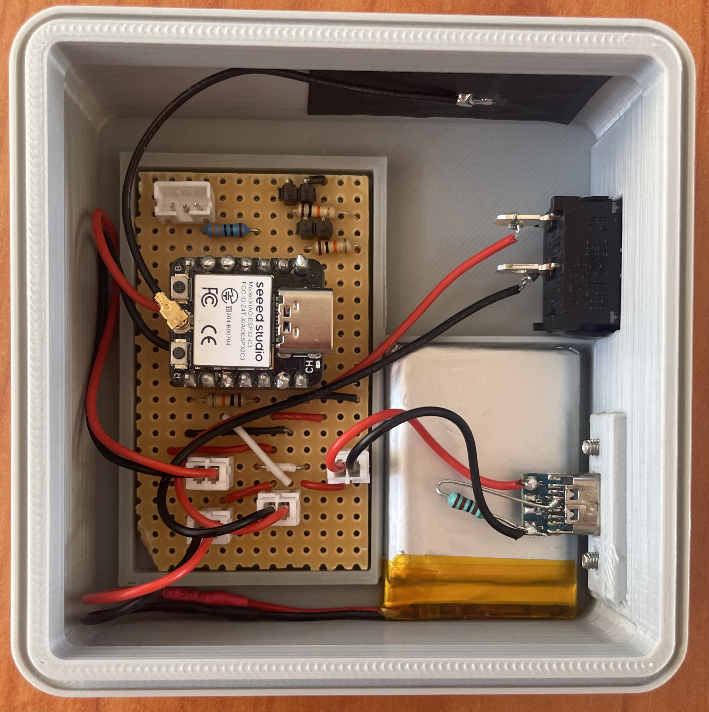

# Anchor winch remote control
Small Note: This is my first Public projct on GitHub so some things might be a bit messy 🙃

## Project Outline
The project aims  to create a remote control for the anker winch on a sailing/ motor yacht. 
Retrofitting a system is expensive and I thought this might be a cool little project to pursue.
The Anchor chain I am working with is the "Lofran's Tigres", however this project should work with most of the models and brands.
(Product Example: https://www.lofrans.com/product/75-hand-held-controls/6600-lofrans-radio-control-chaincounter-thetis-7003 - approx. 250 €)

## Goals
- Controling whinch movement (Up/ Down) wirelessly **Achieved**
- Meassuring chain length and displaying it on the remote

## Project Status - 28. Jul. 2024
Currently the remote remote hardware is designed and capable of fullfiling all project goals. 
The Winch is connected to the Double-Relay which is able to comunicate with the remote control and control the winch. 

A chain counting mechanism is not implemented yet.

## Design Choices
### Micro Controller
The Micro Conrollers I chose are two "Seed Studio Xiao ESP32C3". These are extremly capable yet light weight controllers.
These Micro Controllers where chosen because they are a typical ESP32C3 in a Tiny Form factor and with a **built in battery charging chip**. 
This will run out usefull in the Remote control design.
(Product Link: https://www.seeedstudio.com/Seeed-XIAO-ESP32C3-p-5431.html)

### Controlling the Winch
The anchor winch has a big relay that Controls the turning direction. The relay is controlled by the wired lofrans remote. 
Since the system runs on 12V, the Idea is to use the ESP to switch a new double relay. The Relay mimics the original remote without interfearing with its functionality. Thus, conroling the winch.

The Relay used runs on 5V so I am using a cut up USB C cable to power the ESP. This way we have 5V to power the relay and we only need one step down converter  12V - 5V.

### Designing the Remote
The Remote must fullfill the following requirements:

- 2 Switches for up & down selection
- Rechargable Battery
- Charging indication
- Power switch
- Chain length Indication

**Power**
  
The Heart of the remote is again the Xiao ESP32C3. It is directly connected to the battery via the batter pads on the underside of the PCB. The Power Switch is connected between the battery and the esp.

The Battery can be caharged via a USB-C connecter which connects to the esp on the 5V pin. 

To indicate if the battery is charging, GPIO 10 is connected to the 5V pin and ground to which a 10k resistor leads. This way, if we read HIGH on GPIO 10, we know that the state is charging and we can disable the buttons to avoid accidental whinch operations. 

**Switches**

The switches are simply connected to GPIO 2 & 3 and grounded with 10k resistors. One is used for up and one for down.

**Chain length Indication**

The chain length indication should be intuitive easily readable in direct sun light and big. Therefor I chose to use eight Neo Pixel LEDs for this purpose (Product Example: https://www.aliexpress.com/item/32560280169.html?spm=a2g0o.order_list.order_list_main.41.5b9d180288LQx0). 

Every pixel indicates 10m and the last LED can be used to indicate connection and charging status. Since 70m is also rarely used, the 7th LED could be used to indicate the 5m steps by lighting up when 5m, 15m, 25m and so on are reached and the swithcing off again when the 10s (10m, 20m, 30m) are reached. 

### Chain length Counting
There are several approaches to meassuring the chain length:

- Time
- Infrared Sensor to count revolutions
- Hall Sensor to count revolutions

Using time to meassure the distance would be the easiest however, since the winch spins a bit longer after releasing the button and not always spinning at constant speeds, this method would probably be fairly inaccurate.

Hence, measuring how much chain is layed in one revolution and then counting the revolution after would always be accurate. This comes with the drawback that a sensor will have to be installed in the rough enviroment of a chain locker. Writing the code for this method is however fairly simple and quickly implemented.
Because of chainging light situations and the dirt present in the locker I would opt for the Hall sensor being more reliable and longlasting than the Infrared sensor in this scenario. 
